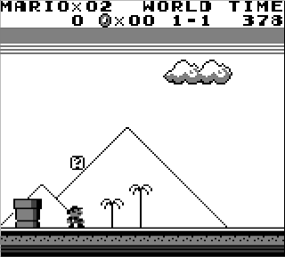
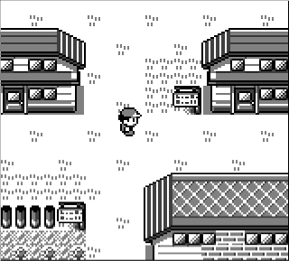

# cboy

An experimental GameBoy emulator written in C for educational purposes. It emulates the hardware, like the LR35902 CPU with its instruction set, MMU, and Display where the rendering is done with OpenGL, and you can play with your keyboard or joystick. Saving is now possible by storing the whole emulation state (CPU registers and memory), so you can immediately continue where you left off.

## Screenshots

## Building

	$ git clone https://github.com/0xf4b1/cboy && cd cboy
	$ mkdir build && cd build
	$ cmake ..
	$ make

## Usage

	$ ./cboy <rom>

It should use joystick from `/dev/input/js0` if available. Only tested with XBOX 360 controller.

## Framebuffer output instead OpenGL

Instead of using OpenGL as renderer, there is another display output method that directly writes to the framebuffer `/dev/fb0`. It only works outside X11 and only takes input from joystick. This method was intended to run the emulator on a Raspberry Pi 2, where the OpenGL performance with GLUT is very poor (would need OpenGL ES 2.0).

To enable display output to framebuffer, use cmake with the following option enabled:

	$ cmake -DRENDERER=FRAMEBUFFER ..

Disable cursor blinking:

	# echo 0 > /sys/class/graphics/fbcon/cursor_blink

# AnBoy

AnBoy is cboy on Android! It uses libcboy based on [NativeActivity](https://github.com/android/ndk-samples/tree/master/native-activity), the rendering is done via OpenGL ES, and the controls are currently very basic, e.g. direction keys via swipe gestures and buttons via tapping on specific display regions. This works quite well for ROMs like `Tetris` or `Pokemon Red/Blue`! :) It comes with a small Activity that allows you to browse your `/sdcard` to select a ROM.

## Building

	$ git clone https://github.com/0xf4b1/cboy && cd cboy/anboy
	$ ./gradlew assembleDebug
	$ adb install anboy/build/outputs/apk/debug/anboy-debug.apk

# nxboy

nxboy is cboy on Nintendo Switch! It uses libcboy for emulation and libnx to directly draw to the framebuffer and for handling the input. Your Switch needs to be able to run homebrew.

## Building

First you need to setup [devkitpro](https://switchbrew.org/wiki/Setting_up_Development_Environment) and have `$DEVKITPRO` set to the installed path.

	$ git clone https://github.com/0xf4b1/cboy && cd cboy
	$ mkdir build && cd build
	$ cmake -DCMAKE_TOOLCHAIN_FILE=../nxboy/cmake/devkita64-libnx.cmake ..
	$ make

## Usage

Copy the `nxboy.nro` on your sd-card into `/switch` and the ROM you want to play to `/switch/rom.gb` and start nxboy via homebrew menu. There is no ROM selection / browser available yet.

# Controls

| Key   | Keyboard    | XBOX controller | AnBoy            | nxboy |
|-------|:-----------:|:---------------:|:----------------:|:-----:|
|Up     | Up          | Up              | Swipe up         | Up    |
|Down   | Down        | Down            | Swipe down       | Down  |
|Left   | Left        | Left            | Swipe left       | Left  |
|Right  | Right       | Right           | Swipe right      | Right |
|A      | A           | A               | Tap lower screen | B     |
|B      | S           | B               | unassigned       | A     |
|Start  | Q           | Start           | Tap middle right | X     |
|Select | W           | Back            | Tap middle left  | Y     |
|Load   | F5          | LB              | Tap upper left   | L     |
|Save   | F6          | RB              | Tap upper right  | R     |

## Implemented

- CPU with full LR35902 instruction set
- MMU
- Display and output via OpenGL (GLUT)
- Controls and input via keyboard and joystick
- Saving emulation state

## Unimplemented

- ~~Saving~~
- Timers
- Sound
- more ...

## Blargg test roms

### cpu_instrs

| ROM                      | Status |
| ------------------------ |:------:|
| 01-special.gb            | ✓      |
| 02-interrupts.gb         | ✗ (not implemented)     |
| 03-op sp,hl.gb           | ✓      |
| 04-op r,imm.gb           | ✓      |
| 05-op rp.gb              | ✓      |
| 06-ld r,r.gb             | ✓      |
| 07-jr,jp,call,ret,rst.gb | ✗ (since 8c0cf79)     |
| 08-misc instrs.gb        | ✓      |
| 09-op r,r.gb             | ✓      |
| 10-bit ops.gb            | ✓      |
| 11-op a,(hl).gb          | ✓      |

## Resources

- http://pastraiser.com/cpu/gameboy/gameboy_opcodes.html
- http://problemkaputt.de/pandocs.htm
- http://marc.rawer.de/Gameboy/Docs/GBCPUman.pdf
- https://github.com/0xf4b1/cyboy
